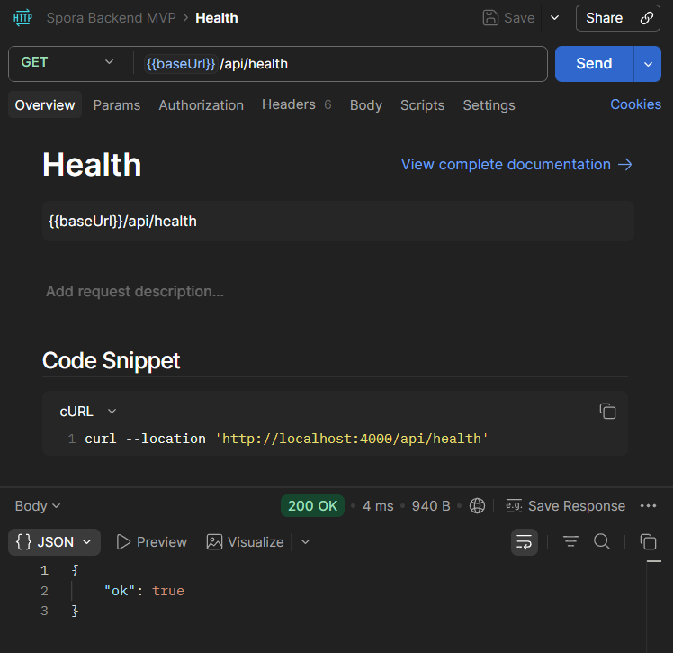
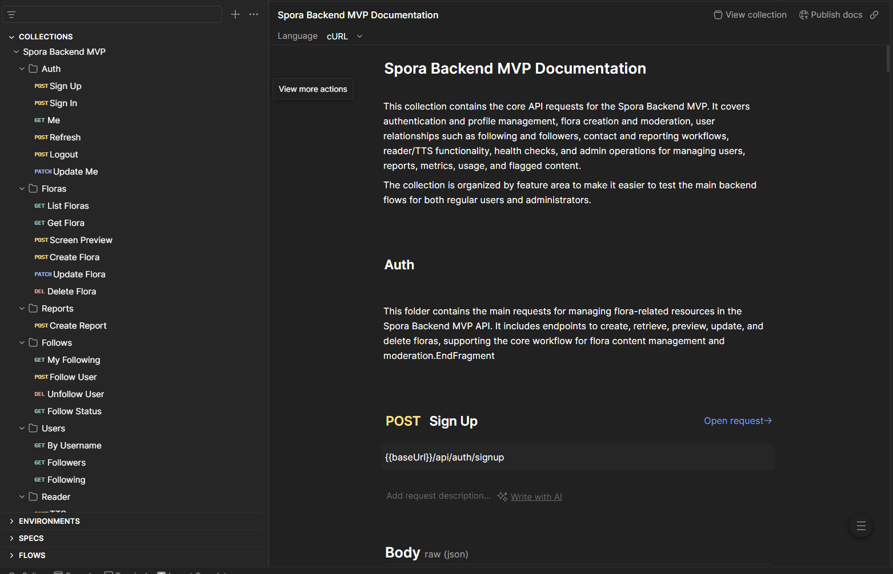
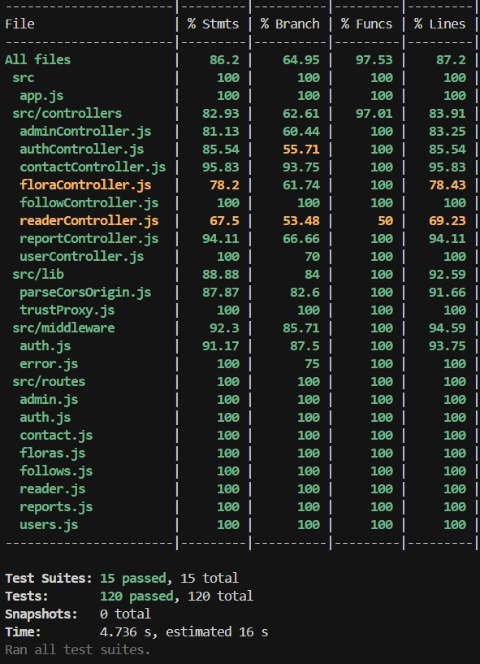
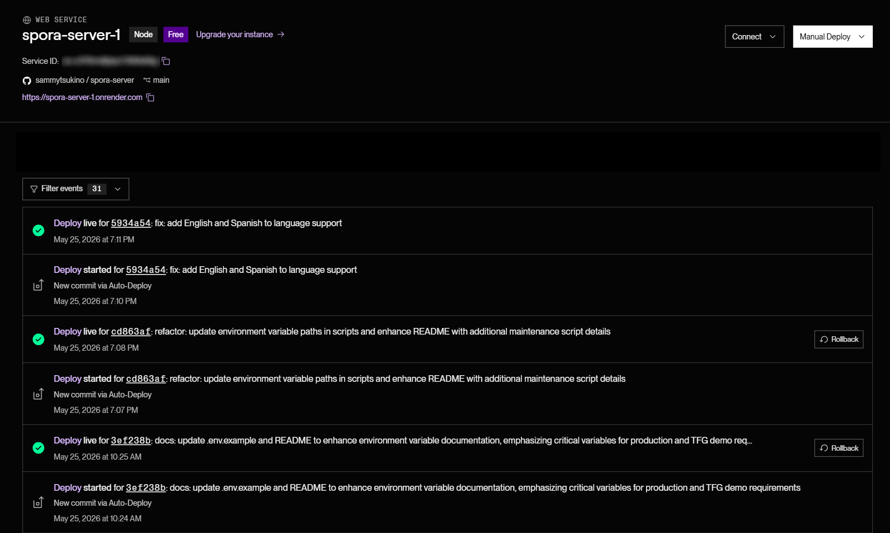

**Text becomes generative art. Collaboration without destruction.**

⟡ ═════════════════════════════════════════ ⟡

## ✦ Table of Contents

- [What is SPORA Server?](#-what-is-spora-server)
- [Screenshots](#-screenshots)
- [Backend Architecture](#-backend-architecture)
- [API Surface Overview](#-api-surface-overview)
- [Tech Stack](#-tech-stack)
- [Getting Started](#-getting-started)
- [Available Scripts](#-available-scripts)
- [Project Structure](#-project-structure)
- [Language Support](#-language-support)
- [Clean Code Guidelines](#-clean-code-guidelines)
- [Domain and Policy Notes](#-domain-and-policy-notes)
- [Testing Notes](#-testing-notes)
- [License](#-license)
- [Author](#-author)
- [Contact](#-contact)

⟡ ═════════════════════════════════════════ ⟡

## ✿ What is SPORA Server?

`spora-server` is the structural root of SPORA: the API layer where authorship, lineage, moderation, and publication rules are preserved over time.

This repository provides:
♦ Authentication and session continuity  
♦ Flora publishing, lineage memory, and retrieval APIs  
♦ Social graph operations (follow/unfollow)  
♦ Moderation and stewardship operations  
♦ Contact form email delivery to active admins  
♦ Optional media/voice integrations (Cloudinary + VoiPi)

> **Note:** The npm package name is `spora-backend`; the repository folder is `spora-server`.

⟡ ═════════════════════════════════════════ ⟡

## ◈ Screenshots

> **Replace placeholders:** add your PNG/WebP files under [`docs/screenshots/`](./docs/screenshots/) using the filenames below. Capture guide: [`docs/screenshots/README.md`](./docs/screenshots/README.md).

| API health | Postman collection |
|:----------:|:------------------:|
|  |  |
| Confirms the backend is reachable | Imported from `postman_collection.json` |

| Test coverage | Deployment |
|:-------------:|:----------:|
|  |  |
| Output of `npm run test:coverage` | Production/staging host with env vars hidden |

⟡ ═════════════════════════════════════════ ⟡

## ♢ Backend Architecture

### Runtime and Security
▸ Node.js + Express  
▸ MongoDB + Mongoose  
▸ `helmet`, `cors`, `express-rate-limit` (for brute-force prevention), `cookie-parser`  
▸ `express-async-errors` for async error propagation
▸ Honeypot mechanism for invisible bot protection during signup

### Auth Model
▸ Access token (short-lived JWT, bearer)  
▸ Refresh token (JWT in secure HTTP-only cookie)  
▸ Account status enforcement (`active`, `suspended`, `deleted`)  
▸ Role enforcement (`cultivator`, `admin`)

### Content and Governance
▸ Flora schema includes lineage, generative payload, license, and moderation state  
▸ Report system for user-generated moderation events  
▸ Admin action logging via dedicated model  
▸ Automatic language-screen report sync for created/updated Floras

### Optional Integrations
▸ **Cloudinary** (avatars + flora thumbnails on publish) — **required for full visual TFG demo**; see [`.env.example`](./.env.example)  
▸ VoiPi for `/api/reader/tts` audio generation  
▸ SMTP for contact form and admin email alerts

⟡ ═════════════════════════════════════════ ⟡

## ❖ API Surface Overview

The API is organized as a set of bounded domains:


*Use `postman_collection.json` to exercise Auth, Floras, Admin, Follows, Reader, and Contact without the SPA.*

### Health
▸ `GET /api/health`

### Authentication
▸ `POST /api/auth/signup`  
▸ `POST /api/auth/signin`  
▸ `POST /api/auth/refresh`  
▸ `POST /api/auth/logout`  
▸ `GET /api/auth/me`  
▸ `PATCH /api/auth/me`

### Floras
▸ `GET /api/floras`  
▸ `GET /api/floras/:id`  
▸ `POST /api/floras/screen-preview`  
▸ `POST /api/floras`  
▸ `PATCH /api/floras/:id`  
▸ `DELETE /api/floras/:id`

### Reader
▸ `POST /api/reader/tts` (powered by VoiPi provider fallback)

### Social
▸ `GET /api/follows/me/following`  
▸ `POST /api/follows/:userId`  
▸ `DELETE /api/follows/:userId`  
▸ `GET /api/follows/:userId/status`

### Users
▸ `GET /api/users/by-username/:username`  
▸ `GET /api/users/:id/followers`  
▸ `GET /api/users/:id/following`

### Reports
▸ `POST /api/reports`

### Contact
▸ `POST /api/contact` (public contact form -> notification emails to active admins)

### Admin
▸ `GET /api/admin/floras` + moderation updates  
▸ `GET /api/admin/reports` + review actions  
▸ `GET /api/admin/users` + role/status/account actions  
▸ `GET /api/admin/metrics`  
▸ `GET /api/admin/usage`  
▸ `GET /api/admin/usage/charts`  
▸ Batch endpoints for users/floras/reports

⟡ ═════════════════════════════════════════ ⟡

## ⚙ Tech Stack

### Core
▸ Node.js (>=18)  
▸ Express 4  
▸ MongoDB + Mongoose 8

### Security and Auth
▸ jsonwebtoken  
▸ bcryptjs  
▸ helmet  
▸ cors  
▸ express-rate-limit  
▸ cookie-parser

### Infrastructure and Services
▸ dotenv  
▸ morgan  
▸ nodemailer  
▸ cloudinary

### Quality
▸ Jest  
▸ Supertest  
▸ Nodemon (development)

⟡ ═════════════════════════════════════════ ⟡

## ◆ Getting Started

### Prerequisites
```bash
Node.js >= 18
npm >= 9
MongoDB (local, Docker, or cloud URI)
```

### Installation
```bash
git clone https://github.com/sammytsukino/spora-server.git
cd spora-server
npm install
```

### Environment Variables

> **Start here:** copy [`.env.example`](./.env.example) to `.env` and follow every comment block.  
> **Do not skip this step.** SPORA is a two-repo system (client + server); misconfigured env vars are the most common cause of “the app loads but nothing works” (empty Garden, failed login, broken contact form, missing flora thumbnails).

The example file documents **where to obtain each value**, **why it is required**, and **what breaks if it is missing**. Read it end-to-end before deploying or presenting the TFG.

#### Quick reference

| Variable | Required | Where to get it | If missing / wrong |
|----------|----------|-----------------|---------------------|
| `MONGODB_URI` | **Yes** (prod) | [MongoDB Atlas](https://www.mongodb.com/cloud/atlas) → Connect → Drivers | No users, floras, or persistence |
| `JWT_SECRET` | **Yes** | `openssl rand -base64 48` (≥32 chars) | Auth cannot work securely |
| `CORS_ORIGIN` | **Yes** (prod) | Public SPA URL (e.g. Vercel) | Browser blocks API; CORS errors |
| `FRONTEND_URL` | **Yes** (prod) | Same SPA URL (no `/api`) | Email links / redirects break |
| `CLOUDINARY_*` (×3) | **Strongly recommended** | [Cloudinary Console](https://cloudinary.com/console) | See below — **critical for TFG demo** |
| `SMTP_*` | Recommended | Gmail app password, SendGrid, etc. | Contact form → 503; no admin mail |
| TTS (VoiPi) | No `.env` key | Bundled in server runtime | Reader voice button may 502 on some hosts |

#### Cloudinary — not optional for a complete SPORA demo

The code treats Cloudinary as “graceful degradation” (the API still creates floras without crashing), but **omitting Cloudinary removes core visible behavior**:

1. **Flora thumbnails on publish** — Laboratory captures the generative canvas and uploads it via the backend. Without `CLOUDINARY_CLOUD_NAME`, `CLOUDINARY_API_KEY`, and `CLOUDINARY_API_SECRET`, floras save **without** `thumbnailUrl`. Garden, Greenhouse, and profile grids show generic placeholders instead of each cultivator’s generative artwork.
2. **Profile avatars** — uploaded avatars are stored in Cloudinary; without credentials they are not persisted.
3. **Thesis narrative** — SPORA’s loop is *write → generate → publish → exhibit*. Skipping Cloudinary breaks the exhibit step even though the text lineage still works.

Free tier is enough for academic deployment. Configure all three Cloudinary variables in **both** local `.env` and Render/production environment.

#### Client ↔ server pairing

In `spora-client`, copy [`.env.example`](../spora-client/.env.example) → `.env`:

```env
VITE_API_BASE_URL=http://localhost:4000/api
```

Rules:

- `VITE_API_BASE_URL` must end with `/api` and match your running backend.
- The SPA origin (e.g. `http://localhost:5173`) must appear in server `CORS_ORIGIN`.
- After changing either side’s env, restart dev servers and redeploy both services in production.

#### Local minimal `.env` (development only)

```env
PORT=4000
JWT_SECRET=use_a_long_random_string_at_least_32_chars
MONGODB_URI=mongodb://localhost:27017/sporadb
CORS_ORIGIN=http://localhost:5173
FRONTEND_URL=http://localhost:5173
CLOUDINARY_CLOUD_NAME=your_cloud_name
CLOUDINARY_API_KEY=your_api_key
CLOUDINARY_API_SECRET=your_api_secret
```

Important startup constraints:

▸ `JWT_SECRET` is mandatory and must be at least 32 characters  
▸ In production, `CORS_ORIGIN` must be explicit (never `*`)  
▸ Full annotated template: [`.env.example`](./.env.example)

### Run
```bash
npm run dev   # nodemon index.js
# or
npm start     # node index.js
```

Verify the API is up:


⟡ ═════════════════════════════════════════ ⟡

## ◈ Available Scripts

```bash
npm run dev            # Start development server with nodemon
npm start              # Start production server
npm test               # Run Jest suite
npm run test:watch     # Jest watch mode
npm run test:coverage  # Coverage report
```

Maintenance scripts (not wired to npm):

▸ `node scripts/verify-all-admins.js` — sets `emailVerified: true` on all admin users in the database  
▸ `node scripts/create-admin.js <username> <password>` — create or promote an admin user (`--promote <username>` to promote an existing account)

⟡ ═════════════════════════════════════════ ⟡

## ◈ Project Structure

```text
spora-server/
├── index.js                      # Main runtime entry; boots src/server.js
├── scripts/
│   └── verify-all-admins.js      # Maintenance: mark admin users as emailVerified
├── config/
│   └── sensitive-terms.json      # Lexical moderation term list
├── src/
│   ├── app.js                    # Express app composition (routes + middleware)
│   ├── server.js                 # Server bootstrap and DB connection
│   ├── config/                   # DB + Cloudinary helpers
│   ├── controllers/              # Domain/business handlers
│   ├── lib/                      # Auth/session/security utility modules
│   ├── middleware/               # Auth + error middleware
│   ├── models/                   # Mongoose domain models
│   ├── routes/                   # Route modules for modular stack
│   └── services/                 # Email and moderation supporting services
├── postman_collection.json       # API testing collection
├── docs/
│   └── screenshots/              # README screenshot assets (see README inside)
└── README.md
```

⟡ ═════════════════════════════════════════ ⟡

## ◈ Language Support

SPORA currently operates with mixed UI/content strings and supports usage in:
▸ **English**  
▸ **Spanish**

This includes user-facing content and editorial copy currently present across the project.

⟡ ═════════════════════════════════════════ ⟡

## ◈ Clean Code Guidelines

These conventions keep `spora-server` maintainable and aligned with current architecture:

### 1) Keep domain boundaries clear
▸ `routes/` only wires endpoints and middleware  
▸ `controllers/` handle request/response orchestration  
▸ `services/` own reusable cross-domain logic (email, moderation helpers, etc.)  
▸ `models/` remain focused on schema/domain shape

### 2) Validate early, fail explicitly
▸ Validate required input fields at controller entry  
▸ Return precise HTTP status + concise error messages  
▸ Avoid silent fallbacks unless explicitly intended for non-critical integrations

### 3) Preserve platform invariants
▸ Keep lineage/moderation/auth rules explicit (not implicit in side effects)  
▸ Protect role/account-status checks close to route boundaries  
▸ Use small helpers for repeated policy logic

### 4) Prefer readable constants over magic values
▸ Extract limits/time windows/status names into named constants  
▸ Use descriptive names (`MAX_MESSAGE_LENGTH`, `ACCESS_TOKEN_EXPIRY`) over inline literals

### 5) Keep async flows understandable
▸ Use early returns to reduce nesting  
▸ Group independent async calls with `Promise.all` where safe  
▸ Log integration failures with context (SMTP/Cloudinary/TTS) without leaking sensitive data

### 6) Protect API contracts
▸ Update README and route docs when endpoint behavior changes  
▸ Keep response shapes stable for frontend consumers  
▸ Add or update tests for changed auth/moderation/email-critical paths

⟡ ═════════════════════════════════════════ ⟡

## ♡ Domain and Policy Notes

### Roles
▸ **Cultivator**: create/publish/manage own Floras and profile  
▸ **Admin**: moderation, user governance, reporting analytics

### Collaboration Integrity
▸ Lineage metadata is preserved across derivative creation  
▸ Moderation actions rely on soft-state transitions where possible  
▸ Anonymization workflows preserve ecosystem continuity

### Compliance-Oriented Behaviors
▸ Account/status controls support reversible moderation  
▸ Author anonymization endpoints preserve derived Flora operability  
▸ Sensitive-language screening is tracked and reviewable

⟡ ═════════════════════════════════════════ ⟡

## ◑ Testing Notes

Backend tests include:
▸ Route-level behavior checks (auth, floras, **admin**, **follows**, **reader**, **contact**)  
▸ Middleware validations  
▸ Utility service tests (token and language screening flows)

Controller coverage is reported separately from routes/middleware. Thresholds apply per domain (`contactController` ≥90%, `followController`/`readerController` ≥60%, incremental targets for `adminController`). Reader TTS success path is validated manually or in staging — Jest asserts validation and 502 when the VoiPi dynamic import is unavailable in the test runtime.

Suggested validation pass before deployment:
```bash
npm test
npm run test:coverage
```


⟡ ═════════════════════════════════════════ ⟡

## ◍ License

This repository is part of the SPORA project.
Code license details are defined in [`LICENSE.md`](./LICENSE.md).

Individual Floras published in the platform are licensed by their authors under platform rules.

⟡ ═════════════════════════════════════════ ⟡

## ◕ Author

**Sammy Cabello**  
SPORA ▸ CEI: Centros de Estudios de Innovacion  
Academic Year: 2025-2026

⟡ ═════════════════════════════════════════ ⟡

## ◈ Contact

▸ **Email:** sammy.cabello.g@gmail.com  
▸ **GitHub:** [@sammytsukino](https://github.com/sammytsukino)

⟡ ═════════════════════════════════════════ ⟡

**SPORA Server** ♡ The backend soil where collaboration, lineage, and governance are rooted.
